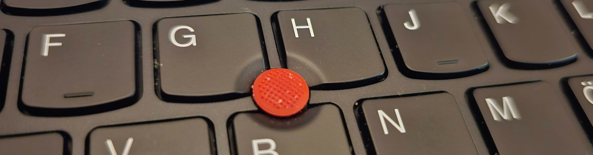

**Sefer Bora Lişesivdin**, Professor of Physics, PhD, SMIEEE

## Codes
Here are some scripts and software that I actively support the development of:

- [Nanoworks](https://nanoworks.readthedocs.io/) - (previously gpaw-tools) Nanoworks is a unified, high-level Python interface for conducting Density Functional Theory (DFT), Molecular Dynamics (MD), and Machine Learning (ML) potential calculations. I am the lead developer.
- [Aestimo 1D](https://aestimosolver.github.io/) - Aestimo is a one-dimensional (1D) self-consistent Schrödinger-Poisson solver for semiconductor heterostructures. I am one of the main developers.
- [spectrum-to-rgb](https://github.com/sblisesivdin/spectrum-to-rgb) - spectrum-to-color is a Python-based tool for converting spectral power distributions (SPDs) to RGB colors using the CIE 1931 color space. I am one of the authors of the related article.
- [Biscuit](https://sblisesivdin.github.io/biscuit/)—Biscuit is a single-page responsive Jekyll theme. It is the simplest yet good-looking Jekyll theme you can find. I maintain it.
- [FQM](https://github.com/sblisesivdin/Folder-Queue-Manager) - A simple software for ad-hoc Directory Monitoring, command executing, and folder copying/moving software for small tasks.

