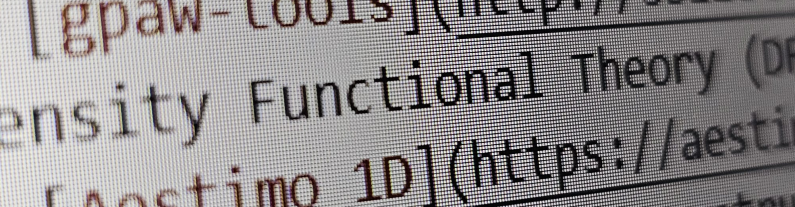

**Sefer Bora Lişesivdin**, Professor of Physics, PhD, SMIEEE

## Codes
Here are some scripts and software that I actively support the development of:

- [gpaw-tools](http://sblisesivdin.github.io/gpaw-tools/) - Collection of Python scripts that use ASE and GPAW for performing Density Functional Theory (DFT) calculations. I am the lead developer.
- [Aestimo 1D](https://aestimosolver.github.io/) - Aestimo is a one-dimensional (1D) self-consistent Schrödinger-Poisson solver for semiconductor heterostructures. I am one of the main developers.
- [Biscuit](https://sblisesivdin.github.io/biscuit/)—Biscuit is a single-page responsive Jekyll theme. It is the simplest yet good-looking Jekyll theme you can find. I maintain it.
- [FQM](https://github.com/sblisesivdin/Folder-Queue-Manager) - A simple software for ad-hoc Directory Monitoring, command executing, and folder copying/moving software for small tasks.

