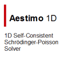

# Welcome,

## Announcement / Duyuru
* We continuously look for interested students and researchers who want to join the fascinating field of low-dimensional material and device research. If you are looking for a PhD position, a Masters work in LRG group, please visit our [related page](https://www.lrgresearch.org/vacancies).
* Düşük boyutlu malzeme ve cihaz araştırmalarının büyüleyici alanına katılmak isteyen ilgilenen öğrencileri ve araştırmacıları sürekli arıyoruz. Bu konularda yüksek lisans ve/veya doktora çalışması gerçekleştirmek istiyorsanız, lütfen [ilgili sayfamızı](https://www.lrgresearch.org/vacancies) ziyaret ediniz.

## Contact Information

* Department of Physics, Gazi University, Ankara, Turkey 06500
  * Laboratory: Lab Building Room 335
  * Office: Class Building Room O-3007
  * Phone: +90 312 202 1391
  * bora@gazi.edu.tr
  * http://sblisesivdin.github.io
  * https://www.linkedin.com/in/sblisesivdin
* More information [about](about.md) me...
* [Latest available CV](files/SBLisesivdin-CV-October2019.pdf) (October 2019).

## Some Links

 
 
 

> "If I have seen further it is by standing on the shoulders of giants." Sir Isaac Newton, Letter to Robert Hooke, February 5th, 1675
