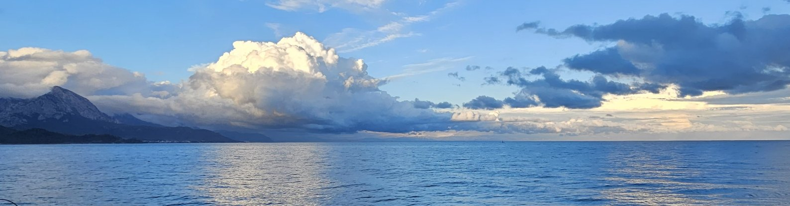

**Sefer Bora Lişesivdin**, Professor of Physics, PhD, SMIEEE

## Home

You can find more information about work, code, news, and contact information on this website.

For a detailed work-based homesite, you can prefer [the homepage at Gazi University](https://avesis.gazi.edu.tr/bora). 

Or maybe you are just looking for the latest version of **[his CV](https://docs.google.com/document/d/17ETxplWt5YEW4qO2rn3N9UFrbDlAp61TotbXeOxZV1g/view?usp=sharing)**.

## Biography

He graduated from Hacettepe University, Department of Physics Engineering in 2003, and completed his M.Sc. studies on electron and magnetotransport properties of AlGaAs/GaAs and InGaAs/GaAs heterostructures at Gazi University, Advanced Technologies Department in 2005. He visited the University of Essex (UK) as a visiting research student for six months. In 2008, he earned his Ph.D. with a dissertation on electron and magnetotransport properties, scattering properties of 2D electrons, and hot electron transport of AlGaN/GaN HEMT structures grown by MOCVD. He then worked as a postdoctoral researcher at Bilkent University, Nanotechnology Research Center, between 2008 and 2009. In 2009, he joined Gazi University as a faculty member and later conducted research at the University of Essex (UK) and Universität Ulm (Germany) as a visiting researcher in 2013 and 2019, respectively. Currently, he is a full professor at Gazi University, Physics Department. He has received the **Turkish Academy of Sciences Distinguished Young Scientist Award (TÜBA-GEBİP)** and the **Turkish Physical Society Prof. Dr. Şevket Erk Outstanding Young Scientist Award**. He is also a **Leaders in Innovation Fellowship** (Royal Academy of Engineering, UK) alumnus and an **IEEE Senior Member**. As of March 2025, he has authored more than 88 SCI articles and 104 conference proceedings in his field. He is married and has one son.

