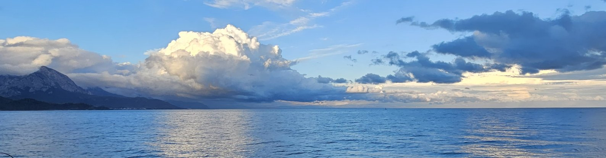

[Home](index.md) | [Work](work.md) | [Codes](codes.md)| [News](news.md) | [Contact](contact.md)

**Sefer Bora Lişesivdin**, Professor of Physics, PhD, SMIEEE

## News

### February 2025

* gpaw-tools version 25.2.1 released. [Visit site](https://sblisesivdin.github.io/gpaw-tools).

### January 2025

* A new article ["Investigation of Spin-Polarized Electronic States of CBVN Defects in h-BN Monolayers"](https://doi.org/10.1016/j.ssc.2025.115855) is published in Solid State Communications.

News before 2025 will be added in the future.
