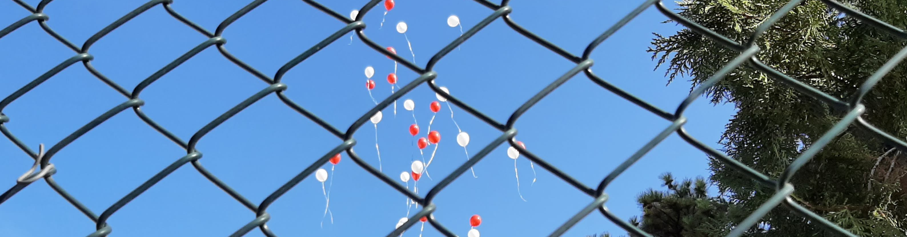

[Home](index.md) | [Work](work.md) | [Codes](codes.md)| [News](news.md) | [Contact](contact.md)

**Sefer Bora Lişesivdin**, Professor of Physics, PhD, SMIEEE

## News

* I am closing the 𝓵𝓻𝓰𝓻𝓮𝓼𝓮𝓪𝓻𝓬𝓱.𝓸𝓻𝓰, which was a home for the last 10 years to our research group. Because our research group became a research laboratory, it has its own [institutional website](https://avesis.gazi.edu.tr/arastirma-grubu/lrg/) for a while. There were also other websites under this domain. Necessary websites under this domain are moved elsewhere (Feb 25, 2025).
* gpaw-tools version 25.2.1 released. [Visit site](https://sblisesivdin.github.io/gpaw-tools) (Feb 3, 2025).
* A new article ["Investigation of Spin-Polarized Electronic States of CBVN Defects in h-BN Monolayers"](https://doi.org/10.1016/j.ssc.2025.115855) is published in Solid State Communications (Jan 29, 2025).
* gpaw-tools version 24.6.1 released. [Visit site](https://sblisesivdin.github.io/gpaw-tools) (Jun 10, 2024).
* On the 100th anniversary of our independent Turkish Republic, we commemorate with gratitude all our martyrs and veterans who enabled us to do science freely (Oct 29, 2023).
* A new article ["Electronic Properties of a Novel Boron Polymorph: Ogee-Borophene"](https://doi.org/10.1155/2023/9933049) is published in Adv. Condens. Matter Phys (Oct 20, 2023).
* gpaw-tools version 23.10.0 released. [Visit site](https://sblisesivdin.github.io/gpaw-tools) (Oct 13, 2023).
* gpaw-tools version 23.7.0 released. [Visit site](https://sblisesivdin.github.io/gpaw-tools) (Jul 4, 2023).
* A new article ["Structural and optical properties of mist-CVD grown MgZnO: Effect of precursor solution composition"](https://doi.org/10.1016/j.physb.2023.414854) is published in Physica B (Jun 15, 2023).
* A new article ["First principles calculations of electronic and optical properties of InSe nanosheets doped with noble metal atoms"](https://doi.org/10.1016/j.commatsci.2023.112114) is published in Computational Material Science (Apr 5, 2023).
* gpaw-tools version 23.2.0 released. [Visit site](https://sblisesivdin.github.io/gpaw-tools) (Feb 1, 2023)
* A new article "[Effect of Sulfur Concentration on Structural, Optical and Electrical Properties of Cu2CoSnS4 Absorber Film for Photovoltaic devices](https://doi.org/10.1016/j.physb.2022.414424)" is published in Physica B (Oct 25, 2022).
* A new article "[Morphological and optical characterizations of different ZnO nanostructures grown by mist-CVD](https://doi.org/10.1016/j.jlumin.2022.119158)" is published in J. Lumin. (Aug 8, 2022).
* Aestimo 1D version 3.0 is released. [Visit site](https://aestimosolver.github.io/) (July 13, 2022).
* gpaw-tools version 22.7.0 is released. [Visit site](https://sblisesivdin.github.io/gpaw-tools) (July 12, 2022).
* gpaw-tools version 22.5.0 is released. [Visit site](https://sblisesivdin.github.io/gpaw-tools) (May 8, 2022).
* Gazi University accepts our new project CuOxMIST: Ga2O3/Cu2O p-n junction production and related computational studies with p-type Cu2O semiconductor thin films grown by Mist-CVD" (Apr 24, 2022).
* gpaw-tools version 22.5.0 is released. [Visit site](https://sblisesivdin.github.io/gpaw-tools) (Apr 7, 2022).

*News before 2022 will be added in the future.*
