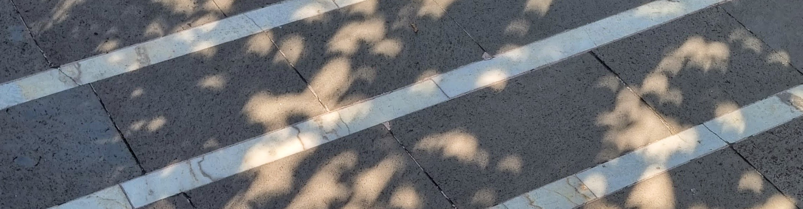

[Home](index.md) | [Work](work.md) | [Codes](codes.md)| [News](news.md) | [Contact](contact.md)

**Sefer Bora Lişesivdin**, Professor of Physics, PhD, SMIEEE

## Work
Presently, I am working as a faculty member at [Gazi University](https://www.gazi.edu.tr) [Department of Physics](https://fizik.gazi.edu.tr/). I am the head of the sub-department of Condensed Matter Physics. In addition, I am the principal investigator of [Low-Dimensional Materials and Systems Research Group](https://avesis.gazi.edu.tr/arastirma-grubu/lrg/), where we work on experimental and computational investigations of low-dimensional or bulk systems with defects and impurities. 

More information from [personal (Avesis) page](https://avesis.gazi.edu.tr/bora) given by my university:
* [Publications](https://avesis.gazi.edu.tr/bora/publications)
* [Projects](https://avesis.gazi.edu.tr/bora/projects)
* [Scientific Activities](https://avesis.gazi.edu.tr/bora/scientificactivities)
* [Achievements & Reputation](https://avesis.gazi.edu.tr/bora/achievements)

You can find more details in the latest version of **[my CV](https://docs.google.com/document/d/17ETxplWt5YEW4qO2rn3N9UFrbDlAp61TotbXeOxZV1g/edit?usp=sharing)**.

Also, you may be interested to see my [OrcID](https://orcid.org/0000-0001-9635-6770), [Google Scholar](https://scholar.google.com.tr/citations?user=WpVqsEkAAAAJ), [Scopus](https://www.scopus.com/authid/detail.uri?authorId=16242267700), [IEEE Collabratec](https://ieee-collabratec.ieee.org/app/p/sblisesivdin) and [Publons](https://publons.com/researcher/A-9748-2008) pages.