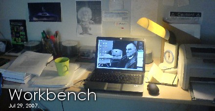

# Workbench

> "Namus, şeref, onur, hepsi güzel ama, en önemlisi helal alınteri." Barış Manço, 1983.

## Collaboration Opportunities

I am open to all scientific collaborations. Please do not hesitate to ask, what we can do. I am mostly interested in Electron and magnetotransport properties of III-V group semiconductor materials, Transport properties of low-dimensional systems as Quantum dots (0D), Quantum wires (1D), Quantum wells (2D), transport, strain, quantum parameters of 2 dimensional electron gas (2DEG) of AlGaN/GaN and AlInN/GaN HEMT structures, hot-electron transport phenomena. Growth, structural analysis, and electrical analysis of mist-CVD grown oxides (ZnO, MgZnO, MgO, Ga2O3, etc.).

## Recent Works

You can find published articles at the [Publications](publications.md).

### Accepted Works

* n/a

### Submitted Works

* E. Kutlu, P. Narin, A. Yildiz, S. B. Lisesivdin "Effect of Magnesium Content and Growth Temperature on Structural and Optical Properties of USCVD grown MgZnO films" PE
* P. Narin, E. Kutlu, S. B. Lisesivdin "Growth dynamics of mist-CVD grown ZnO Nanoplatelets" 
* G. Atmaca, P. Narin, E. Kutlu, T. Malin, V. Mansurov, K. Zhuravlev, S.B. Lisesivdin, E. Ozbay "The Dependence of Hot-Electron Temperature and Hot-Phonon Lifetime on Electric Field in GaN-based Heterostructures" PSS
* G. Atmaca et al. "Molarity effect of precursor solution ZnO" 

### MIA

* K. Elibol, G. Atmaca, S. B. Lisesivdin, M. Kasap, S. Butun, T. Ciuk, W. Strupinski, A. Meyer, J. I. Flege, J. Falta, and E. Ozbay "Electron transport mechanism in monolayer epitaxial graphene on (6√3 x6√3)R30° reconstructed 6H-SiC(0001)"
* K. Elibol, B. Sarikavak-Lisesivdin, C. Gunes, A. F. Kuloglu, S. B. Lisesivdin and M. Kasap "Numerical and Analytical Investigation of the Effects of InAlN/AlGaN Barrier in GaN-Based HEMTs"
* I. Kara, O. Yalcinkaya, S. B. Lisesivdin, M. Kasap "Analysis Of The Number Of Shots Using Graphite Furnace Atomic Absorption Spectrometry On The Gunshot Residues Deposited in The Barrel"
* G. Atmaca, K. Elibol, B. Sarikavak Lisesivdin, S. B. Lisesivdin, M. Kasap, E. Ozbay "Two Dimensional Electron Gas in InAlN/GaN Double Barrier Heterostructures" 

*: With respect to [old good days](http://en.wikipedia.org/wiki/Workbench_%28AmigaOS%29).

## Codes

In addition to my professional studies, I like to code as a hobby. Here, you can find some programs and small scripts that I coded/developed mostly alone. 

Since my childhood, I am interested in programming. I started with Basic V.2.0 of Commodore 64. Then mainly AROS on Amiga, Fortran, Perl, PHP, Pascal (Delphi), Python and FreePascal (Lazarus) on PC. Sometimes, it was a wiki engine, sometimes a X-ray diffraction analysis software and sometimes cheesy codes. I can not define myself a good coder, just a old headed hobbyist try to do something without using object-oriented programming chaos.

### Out-dated software

These small scripts/codes are dated back to when I was a BSc student.

* **LiesHeCount v.2.0 (1999):** Simple Multipage Counter Script (453 bytes ZIPped!) Very simple, page counter for multiple pages. Coded in Perl.  There must be a third version which can detect pages automatically. I can't find it.
* **CyBanner v.0.1.3, (2000):** Simple Banner Rotation Script(2077 bytes ZIPped) Very simple, picture banner rotation and statistics system. Coded in Perl.
* **PICtoASCII v.0.1.2 (2001):** Windows program for transforming BMP files to ASCII art. Coded in Delphi.
* **IcePLOT v.3.0 (2002):** A X-Ray Diffraction Analysis software package coded on Delphi. Software was a successor of v.20 which was coded on Labview. It was done as BSc senior year project. 
* **CPS CP/BL v.1.0 (2002):** A PHP script for web-based translation of PO files. 
* **Accsis v.1.0 (2002):** A small PHP CRUD generator that I coded for a medical society in Turkey.
* **Tisis  v.1.0 (2002):** A small e-commerce script, which is forked from MyMarket script, working with PayPal.
* **Wiksis v.1.1 (2003):** A small wiki engine forked from TipiWiki. It will be called Wikepage after v.1.1.
* **Websis v.1.0 (2003):** A CMS forked from AWF. Abandoned after working on Wiksis/Wikepage.

### Softwares that still can be used

* **[Wikepage Opus 14 v.2008.1 (2004-2008)](http://www.wikepage.org):** It is a multi-language blog-wiki hybrid derived from Wiksis. It released 14 versions and used in more than 1000 sites. After transferring the development responsibilities of the software, there was no new releases. It is a simple and strong script. I personally used to built nearly 10 sites from company sites to university department sites. I am seeing that still (2019) it is downloaded and used as is. However it may not be %100 compatible with PHP7.

### Softwares in active development

* **[Aestimo 1D v.2.0 (2012-...)](http://www.aestimosolver.org):** Aestimo is a one-dimensional (1D) self-consistent Schrödinger-Poisson solver for semiconductor heterostructures. Aestimo is started as a hobby at the beginning of 2012, and become an usable tool which can be used as a co-tool in an educational and/or scientific work. 
* **[Dehapad v.5.0 (2016-...)](https://sblisesivdin.github.io/dehapad):** Dehapad is a really very simple - light notepad application. It is not for programmers or writers.  It has a sidebar mode, encryption-decryption and some other interesting features, that you can not find in many text editors. It is my current "hobby".
* **[IRIS v.1.27 (2018-...)](https://www.biarsis.com/products/iris-software):** IRIS is a spectral acquisition and analysis program that is developed specially for Biarsis Argus 1000 series spectrometers. I am the sole developer of this project.
* **[MOCA v.0.72 (2019-...)](https://www.biarsis.com/):** MOCA is a software for calculating the optical absorbtion/reflection spectrum of multilayer structures. These multilayer structures can be stacks of metals, semiconductors and insulators.
* **[Folder Queue Manager (FQM) (2020-...)](https://github.com/lrgresearch/Folder-Queue-Manager):** A simple software for adhoc Directory Monitoring, command executing and folder copying/moving software for small tasks.
